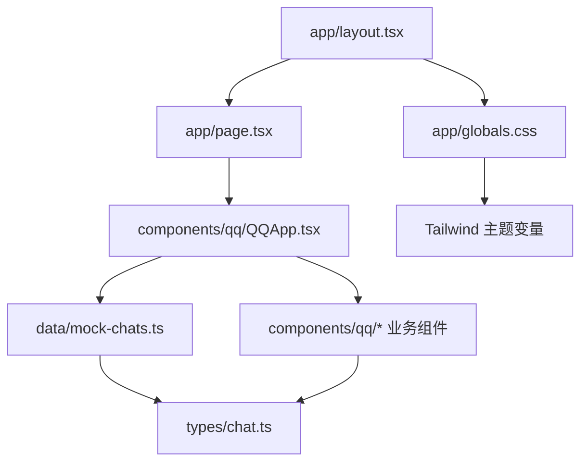

# QQ 消息交互原型

一个基于 **Next.js + React + Tailwind CSS** 的 QQ 风格移动端消息交互原型。  
当前项目以 **前端交互展示** 为主，使用本地 mock 数据模拟会话列表、聊天详情、底部导航、搜索、长按菜单和 AI 待办卡片等能力。

## 项目定位

- 目标是还原 QQ 移动端消息页的核心交互体验
- 重点展示消息列表、会话详情和上下文操作
- 采用客户端状态管理，不依赖后端接口
- 适合作为 UI 原型、组件演示或后续接入真实数据源的基础工程

## 技术栈

- **Next.js 16**
- **React 19**
- **TypeScript**
- **Tailwind CSS 4**
- **Radix UI**
- **lucide-react**
- **next-themes**
- **@vercel/analytics**

## 整体架构

项目采用“页面壳 + 业务组件 + mock 数据 + 类型定义”的轻量分层结构：



### 数据流

1. `app/page.tsx` 作为首页入口，只负责把 `QQApp` 挂载到页面上。
2. `QQApp` 负责管理页面级状态：
   - 当前 tab
   - 当前选中的聊天
   - 搜索关键词
   - 会话列表数据
3. `mockChats` 提供会话与消息的静态数据。
4. `ChatList`、`ChatDetail`、`BottomNav` 等组件根据状态渲染不同视图。
5. 用户交互通过回调向上汇总，再由 `QQApp` 更新状态并驱动界面刷新。

## 目录结构

```text
.
├─ app/
│  ├─ layout.tsx          # 根布局、字体、Metadata、Analytics
│  ├─ page.tsx            # 首页入口
│  └─ globals.css         # 全局样式入口
├─ components/
│  ├─ qq/                 # QQ 业务组件
│  │  ├─ QQApp.tsx        # 页面级容器，负责状态编排
│  │  ├─ ChatList.tsx     # 会话列表容器
│  │  ├─ ChatDetail.tsx   # 聊天详情页
│  │  ├─ BottomNav.tsx    # 底部 tab 导航
│  │  ├─ StatusBar.tsx    # 状态栏
│  │  ├─ UserHeader.tsx   # 顶部用户信息区
│  │  ├─ SearchBar.tsx    # 搜索框
│  │  └─ DeviceLoginBar.tsx # 设备登录提示条
│  ├─ ui/                 # 通用 UI 基础组件
│  └─ theme-provider.tsx  # 主题上下文封装
├─ data/
│  └─ mock-chats.ts       # mock 会话、用户、消息数据
├─ hooks/
│  ├─ use-mobile.ts       # 移动端断点判断
│  └─ use-toast.ts        # Toast 相关封装
├─ lib/
│  └─ utils.ts            # `cn` 等通用工具
├─ public/
│  ├─ avatars/            # 会话头像素材
│  └─ icon*.png/svg       # 应用图标
├─ styles/
│  └─ globals.css         # 全局样式补充
├─ types/
│  └─ chat.ts             # 聊天领域类型定义
├─ package.json
└─ pnpm-lock.yaml
```

## 核心模块说明

### 1. 页面入口层

- `app/layout.tsx`
  - 定义根 HTML 结构
  - 注入全局字体和 Metadata
  - 生产环境下启用 Vercel Analytics
- `app/page.tsx`
  - 将主应用 `QQApp` 渲染到页面中
  - 外层限制为手机宽度，模拟移动端机身视图

### 2. 业务编排层

- `components/qq/QQApp.tsx`
  - 是整个项目的核心容器
  - 负责 `messages / contacts / moments` 三个 tab 的切换
  - 负责会话搜索、会话选择、返回列表等状态控制
  - 处理“打开会话后清空未读数”的交互
  - 将消息列表和聊天详情两个视图串联起来

### 3. 会话与消息展示层

- `ChatList.tsx`
  - 渲染会话列表
  - 当搜索结果为空时展示空状态
- `ChatListItem.tsx`
  - 单个会话卡片
  - 负责头像、摘要、时间、未读数等信息展示
- `ChatDetail.tsx`
  - 聊天详情页
  - 支持文本、图片、文档、引用、链接、任务卡等消息类型
  - 支持长按/右键呼出上下文菜单
  - 内置 AI 待办卡片和倒计时逻辑

### 4. 基础 UI 层

- `components/ui/*`
  - 提供按钮、弹窗、选项卡、头像、表单等通用组件
  - 主要作为业务层的底座
- `theme-provider.tsx`
  - 预留主题切换能力

### 5. 数据与类型层

- `data/mock-chats.ts`
  - 当前所有会话、消息、用户信息都来自这里
  - 适合在没有后端时快速演示交互
- `types/chat.ts`
  - 定义 `ChatItem`、`Message`、`UserProfile`、`TabType` 等核心模型
  - 让消息类型更清晰，也方便后续接 API 数据

## 当前已实现的交互

- 会话列表展示
- 搜索过滤会话
- 点击会话进入详情页
- 返回会话列表
- 底部 tab 切换
- 长按/右键消息弹出上下文菜单
- 复制消息内容
- AI 待办卡片展示
- 消息输入框与发送按钮状态切换
- 全员禁言场景展示

## 本地运行

```bash
pnpm install
pnpm dev
```

常用脚本：

```bash
pnpm dev
pnpm build
pnpm start
pnpm lint
```

## 项目约束

- 当前没有真实后端接口，数据全部来自本地 mock
- 交互状态主要由 `QQApp` 内部 `useState` 管理
- 项目偏原型与展示用途，适合先验证 UI/交互，再替换真实数据

## 后续扩展建议

如果后面要继续完善，这个项目比较适合按下面方向扩展：

1. 把 `data/mock-chats.ts` 替换成真实 API 层
2. 为 `ChatDetail` 拆分更细的消息渲染器
3. 增加会话搜索、高亮和筛选能力
4. 为上下文菜单补齐复制、转发、引用、删除等动作
5. 把 AI 待办能力接入真实的消息理解/任务提取服务

## 备注

- 视觉上是移动端 QQ 风格原型，外层容器已做窄屏限制。
- `components/ui` 目录提供的基础组件较完整，说明项目后续可继续扩展到更复杂的表单、弹窗和侧栏场景。

## Agent 接入说明

当前“加入待办”已经接到 Tencent LKEAP 的 OpenAI 兼容接口，前端会把选中的消息发到服务端路由：

- `app/api/agent/task-card/route.ts`

这个路由里做了两件事：

- 读取 `LLM_API_KEY`、`LLM_BASE_URL`、`LLM_MODEL`
- 如果接口失败，会自动降级到本地 fallback 解析，保证界面还能演示

### 需要配置的环境变量

把下面内容放到项目根目录的 `.env.local`：

```bash
LLM_API_KEY=你的腾讯云 key
LLM_BASE_URL=https://api.lkeap.cloud.tencent.com/plan/v3
LLM_MODEL=hy3-preview
```

### 这里怎么填

- `LLM_BASE_URL` 就填你提供的这个：`https://api.lkeap.cloud.tencent.com/plan/v3`
- `LLM_MODEL` 建议填 **模型 ID**，也就是 `hy3-preview`
- 页面里看到的 `Hy3 preview` 是展示名，不是接口里该填的值

### 结构化输出设计

服务端要求模型只输出这 4 个字段：

- `taskName`: 任务名称
- `deadlineText`: 原始截止时间文本，比如 `明天 15:00`
- `deadlineISO`: 解析后的 ISO 8601 时间
- `steps`: 任务清单数组

后端拿到这份 JSON 后，会把 `deadlineISO` 转成时间戳，再组装成前端任务卡片使用的 `TaskCard`。

### 前端接入点

- 长按消息后，弹出的菜单里点击 `加入待办`
- `components/qq/ChatDetail.tsx` 会把消息发给 `/api/agent/task-card`
- 返回结果会通过 `QQApp` 写回当前会话消息列表

### 这套方案的优点

- 不需要把 key 放前端
- 后面如果你换别家兼容 API，只改 `.env.local` 就行
- 前端渲染和卡片结构不用动

### 如果你想继续扩展

后面可以把这个路由继续升级成更完整的 Agent 编排层：

- 增加 `agentName`，支持不同 Agent 处理不同消息
- 把 `steps` 再细分为 `title + status + dueDate`
- 为“存入日历”和“设置提醒”按钮接真实业务接口

